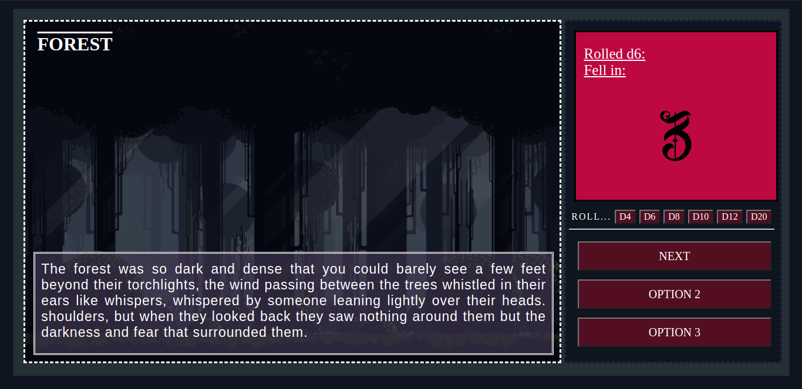
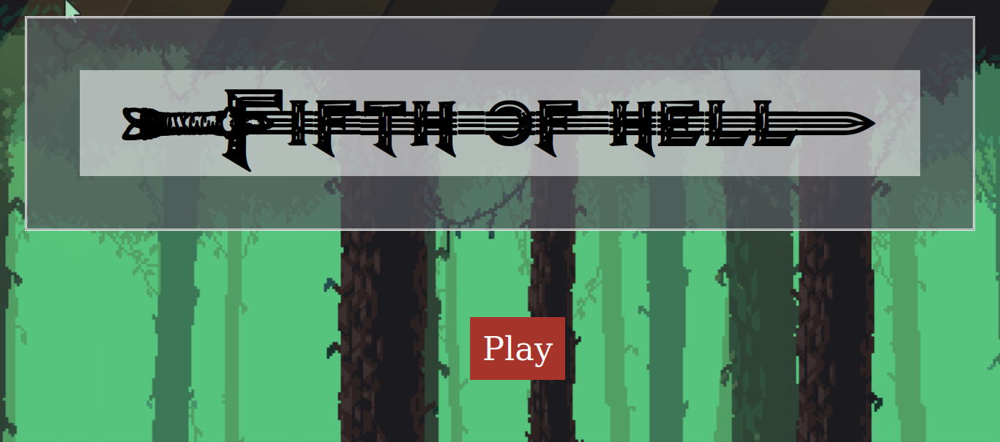

# RPG - Fifth Of Hell

Durante a disciplina de lingua inglesa, a professora nos incentivou a criar um RPG, aonde nós mesmos que idealizariamos o sistema, a história, e como ele funcionaria. Então criei esse jogo para apresentar a minha turma, que eu fiz utilizando HTML, CSS e Javascript.

O jogo se baseia no modelo de novel, aonde são exibidas imagens que representam o contexto atual em que o jogador se encontra com textos, que explicam a narrativa, a priori o jogo foi feito para servir de complemento a uma sessão de RPG, então ele foi idealizado para ser jogado em grupo. Além disso o projeto conta com um sistema próprio de rolagem de dados virtuais, aonde o jogador não precisa ter necessáriamente os dados de RPG, para poder jogar.

## Prints do jogo:

</img>
</img>

(As imagens utilizadas para servir de background não são de minha autoria, dedico totalmente o crédito delas aos seus devidos criadores)

